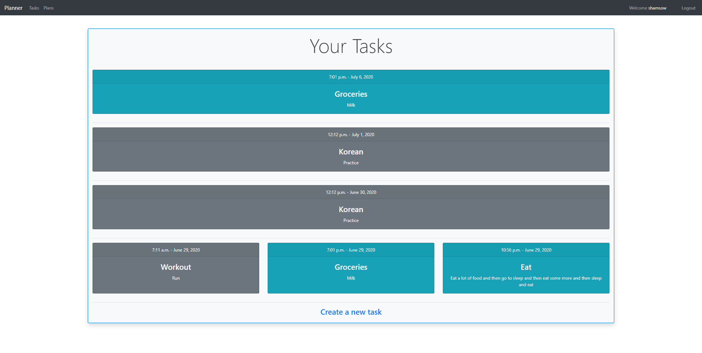

# Planner

This is a simple web app that allows users to create and track tasks they need to do, sort of like a TODO list.

The goal I had in my mind while working on this project wasn't really to make a revolutionary new planner app, it was simply to explore Django as much as possible.

This app touches on many aspects of Django that were completely new territory for me, so I guess it served its purpose.

Some of these new topics were:
- Deeper dive in to Django form (Model forms)
- Dynamic URL routing
- Multiple apps in one project
- Model methods

And a few more as well that were minor but still important for me to learn moving forward.